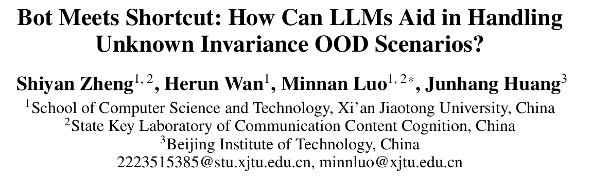
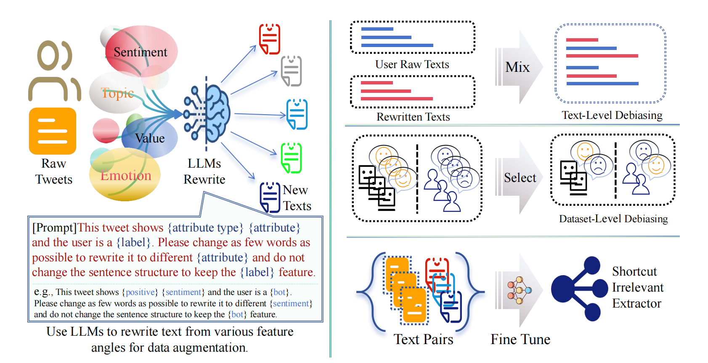

# Bot Meets Shortcut

Code for paper,
**Bot Meets Shortcut: How Can LLMs Aid in Handling Unknown Invariance OOD Scenarios?**

<p align="center"><a href="https://arxiv.org/abs/2511.08455"></a>

---

<p align="center">
  
</p>

<p align="center">
  
</p>

**Main Idea**:

As social bots evolve, evaluating detectors under challenging shortcut-biased scenarios reveals vulnerabilities, motivating LLM-based strategies to uncover what truly makes an account a social bot.

This work demonstrates that potential shortcuts derived from native web datasets can severely bias social-bot detection, undermining model reliability. To mitigate these effects, we introduce efficient LLM-based strategies to detect and correct shortcut-driven artifacts at the levels of individual data, the overall dataset, and feature-extraction models.

---

## Code for Bot Meets Shortcut

>deal_data -> PotentialShortcut -> DrawFeature -> StandardShortcut, BotRGCN, AMR_CIGA -> LLMsRewrite -> TextDatasetLevel -> FineTune

```bash
Place the raw data into the deal_data folder and run the according scripts. 
This will produce cleaned datasets in deal_dataset folder.

python ./deal_data/DealData/cresci-2017-data.py
```

```bash
Run PotentialShortcut to construct potential shortcuts scenarios (split the data into training and testing sets).
The resulting files will be saved in the deal_dataset folder and data folder.

python ./PotentialShortcut/deal_data.py
python ./PotentialShortcut/split_tweets.py

Alternatively, you may download our cleaned data and put json files into deal_dataset folder and pt files to data folder.
```

```bash
Run DrawFeature to construct feature representations.
The generated feature files will be stored in the data folder.

python ./DrawFeature/feature_processer_tweets.py
```

```bash
Run StandardShortcut to compare the performance of standard and shortcut scenarios.

python ./StandardShortcut/run.py
```

```bash
The LLMsRewrite folder contains the implementations of our LLM-based rewriting strategies.

python ./LLMsRewrite/llm_modify.py
python ./LLMsRewrite/deal_result/enhance_data.py
```

```bash
The FineTune folder contains the code for fine-tuning feature-extraction models.
Prepare suitable text pairs based on the rewritten dataset (e.g., training-set pairs, or other large-scale rewritten pairs)
```

---

## Dataset

load dataset and preprocess data running corresponding scripts in the deal_dara folder or load our processed data from [cleaned data](https://drive.google.com/drive/folders/1Z3Xy-X9eH8uTdEfCL18CCTrcRtTT_Oi_?usp=drive_link) (put deal_data folder to deal_dataset folder, and put data folder to data folder) 

---

todo:

- [x] release all code
- [x] Release the dataset
- [x] Add usage instructions

---

## Thanks

Part of this code follows the repositories:
- https://github.com/BunsenFeng/BotRGCN
- https://github.com/LCS2-IIITD/Hyphen
- https://github.com/LFhase/CIGA.

Sincerely thank the authors for their open-source contributions.

---

## Citation

If you find our work interesting or helpful, please consider citing this paper

```bibtex
@article{zheng2025bot,
  title={Bot Meets Shortcut: How Can LLMs Aid in Handling Unknown Invariance OOD Scenarios?},
  author={Zheng, Shiyan and Wan, Herun and Luo, Minnan and Huang, Junhang},
  journal={arXiv preprint arXiv:2511.08455},
  year={2025}
}
```
